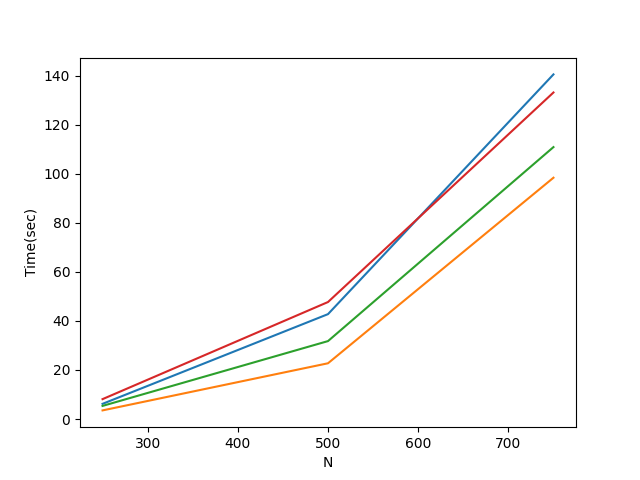

N | No blocking | 1-blocking S~N/4 | 1-blocking S~N/8 | 1-blocking S~N/16 
---- | ---- | ---- | ---- | ----
250 | 6.185982942581177 | 3.5141375064849854 | 5.34631085395813 | 8.10411262512207
500 | 42.77980065345764 | 22.735530376434326 |31.782694101333618 | 47.71538972854614 | 
750 | 140.55998587608337 | 98.41511559486389 | 110.90812873840332 | 133.18228816986084 |

We can see from above table Blocking is better and blocking it to very small s is also bad