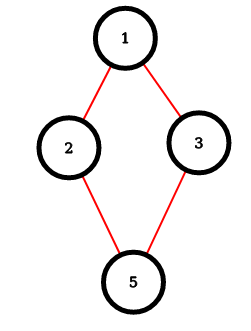
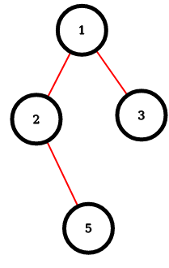
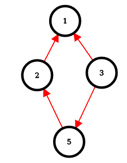
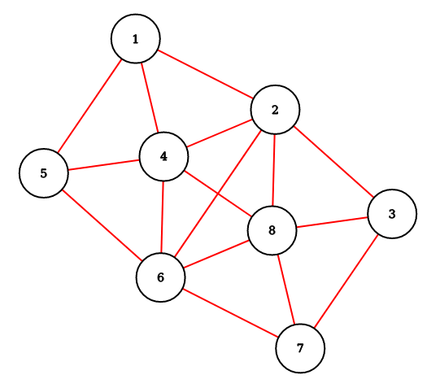
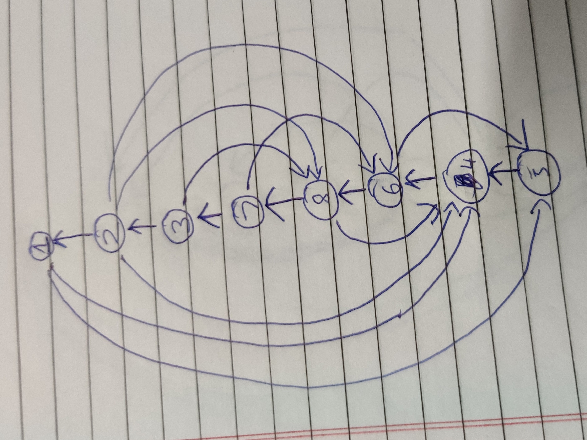
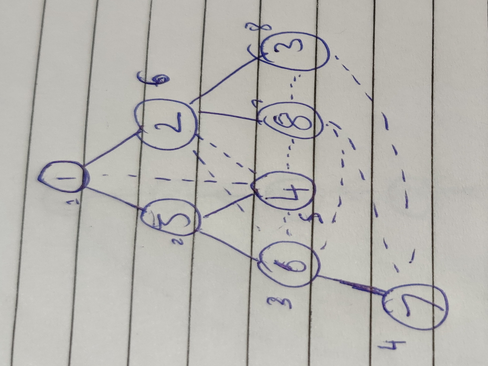

# Assignment 3

## Q1)

### Jen-Schmidt Algorithm for Ear Decomposition

1. Find a rooted DFS tree.
2. Give DFS number to each vertex.
3. Direct Edges in the DFS tree towards the `root` vertex
4. Direct Non Tree edges away from the `root` vertex.
5. Have {visited, not-visted} flag for each vertex.
6. Take the Non tree edge with minimum DFS number`(min(dfsnum(u), dfsnum(v)))`
7. Trace the simple cycle traced by that edge and mark all vertices in the cycle as `visited`
8. All edges in this cycle belong to a EAR component
9. Loop:

- i. Take the Non tree edge with minimum DFS number`(min(dfsnum(u), dfsnum(v)))`
- ii. Trace the simple cycle traced by that edge until we reach a vertex that is visted.
- iii. Mark all vertices in the cycle as `visited`
- Iv. All edges traversed till finding the visited vertex belong to a EAR component

### Our Question

- We are asked used a Non-DFS tree instead of DFS tree.
- One direct observation is in a Non DFS tree there might be `cross edges`, where as in DFS tree only `back edges` exist.[graph is un-directional]
- So what essentially happens assume there is `cross edge`,then it will form a cycle with LCA of the two vertices, which need not be one of `u`,`v`.
- The problem is when X->(lca(u,v)) is not one of `u`,`v`.
- In which case path to both `u` and `v` from `X` will contain only edges going towards the root,only edge `(u,v)` away from the root.
- In which case, simple cycle does(need) not exist for all these nodes in the path so edge `(u,v)` has possibilty of not ending up in any ear.

- We can see from this directed graph for jen algorithm below(which the directed graph with BFS tree rooted at 1), that there is simple cycle induced by non tree edge `(3,5)`

- So Any spanning tree will not work , DFS trees works becuase there are no cross edges, cross edges as non tree edges need not induce a simple cycle , when directions are given according to our algorithm.

- Back edges dont cause these problem

- Graph:

- BFS tree:

- Directed graph for jen schmidt

## Question 2

### Jen schmidt algorithm

- Non tree edges:

edge(u,v) -> DFS number

1. (1,5) -> 1
2. (1,4) -> 1
3. (2,4) -> 2
4. (2,6) -> 2
5. (2,8) -> 2
6. (3,8) -> 3
7. (7,6) -> 4
8. (8,4) -> 5
9. (6,3) -> 6

- Now the Ear each non tree edge induces:

1. (1,5) -> [(1,5),(5,4),(4,6),(6,8),(8,7),(7,3),(3,2),(2,1)] , vis = [1,2,3,4,5,6,7,8]
2. (1,4) -> [(1,4)],    vis = [1,2,3,4,5,6,7,8]
3. (2,4) -> [(2,4)],    vis = [1,2,3,4,5,6,7,8]
4. (2,6) -> [(2,6)],    vis = [1,2,3,4,5,6,7,8]
5. (2,8) -> [(2,8)],    vis = [1,2,3,4,5,6,7,8]
6. (3,8) -> [(3,8)],    vis = [1,2,3,4,5,6,7,8]
7. (7,6) -> [(7,6)],    vis = [1,2,3,4,5,6,7,8]
8. (8,4) -> [(8,4)],    vis = [1,2,3,4,5,6,7,8]
9. (6,3) -> [(6,3)],    vis = [1,2,3,4,5,6,7,8]

### Ramachandran algorithm

- Tree rooted at vertex 1

| vertex | Preoder number |
|:-------:|:--------------:|
| 1 | 1 |
| 2 | 6 |
| 3 | 8 |
| 4 | 5 |
| 5 | 2 |
| 6 | 3 |
| 7 | 4 |
| 8 | 7 |

- Non tree edges:

|index |edge(u,v) |  LCA | Preder Number |
|:----:|:--------:|:----:|:--------------:|
|1. | (1,4) | 1 | 1 |
|2. | (4,2) | 1 | 1 |
|3. | (6,2) | 1 | 1 |
|4. | (4,6) | 5 | 2 |
|5. | (4,8) | 1 | 1 |
|6. | (3,8) | 2 | 6 |
|7. | (6,8) | 1 | 1 |
|8. | (7,8) | 1 | 1 |
|9. | (7,3) | 1 | 1 |

- Sort non tree edges by their preorder number LCA

| Sort Number |edge(u,v) |  LCA | Preder Number |
|:----:|:--------:|:----:|:--------------:|
|1. | (1,4) | 1 | 1 |
|2. | (4,2) | 1 | 1 |
|3. | (6,2) | 1 | 1 |
|4. | (6,8) | 1 | 1 |
|5. | (7,8) | 1 | 1 |
|6. | (7,3) | 1 | 1 |
|7. | (4,8) | 1 | 1 |
|8. | (4,6) | 5 | 2 |
|9. | (3,8) | 2 | 6 |

- Labeling Tree edges:

| Index |edge(u,v) | lables of cycle in which present | label of edge |
|:----:|:--------:|:----:|:--------------:|
|1. | (1,2) | 2,3,4,5,6,7 | 2 |
|2. | (1,5) | 1,2,3,4,5,6,7 | 1 |
|3. | (5,4) | 1,2,7,8 | 1 |
|4. | (5,6) | 3,4,5,6,8 | 3 |
|5. | (6,7) | 5,6 | 5 |
|6. | (2,8) | 4,5,7,9 | 4 |
|7. | (2,3) | 6,9 | 6 |

- Final Ear decomisition:
  - Label 1: [(1,4),(1,5),(5,4)]
  - Label 2: [(4,2),(1,2)]
  - Label 3: [(6,2),(5,6)]
  - Label 4: [(6,8),(2,8)]
  - Label 5: [(7,8),(6,7)]
  - Label 6: [(7,3),(2,3)]
  - Label 7: [(4,8)]
  - Label 8: [(4,6)]
  - Label 9: [(3,8)]

- We can move intial non tree edge to Label 0(here the above in itself ear decompsed):
  - Label 0  [(1,4)]
  - Label 1: [(1,5),(5,4)]
  - Label 2: [(4,2),(1,2)]
  - Label 3: [(6,2),(5,6)]
  - Label 4: [(6,8),(2,8)]
  - Label 5: [(7,8),(6,7)]
  - Label 6: [(7,3),(2,3)]
  - Label 7: [(4,8)]
  - Label 8: [(4,6)]
  - Label 9: [(3,8)]

## Question 3

### Algorithm

- We have seen in class that if we multiply Adjacency matrix with itself it gives no of paths of length `2` between(i,j).
- Now for it form a triangle there should path on length `1` ans `2` between given vertices `(i,j)`
- And we also known that AxA [i,j] gives no of paths of length 2 between `(i,j)`
- So total number of triangles = sum of all{ (AxA[i,j] * A[i,j])}/3
- division by 3 comes becuase of each edge in traingle will given one value to the sum.
- Pseudo Code:

1. Sum ← 0
2. compute A2
3. for i = 1 . . . n do
4. for j = 1 . . . n do
5. Sum ← Sum + A[i,j] · (A*A) [i,j]
6. return Sum/3

### Timecomplexity

- Basically finally triangle couting after matrix multplication cause `O(N^2)`
- Matrix Multuplication - fastest known is `O(N^2.37)`
- So overall time complexity is - `O(N^2)+O(N^2.37)` = `O(N^2.37)`
